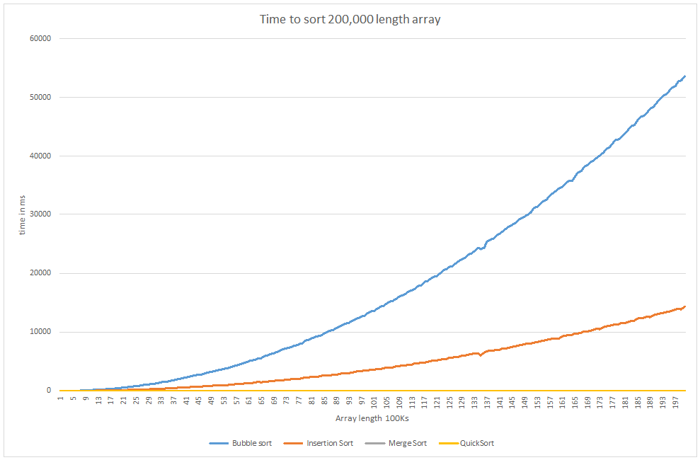
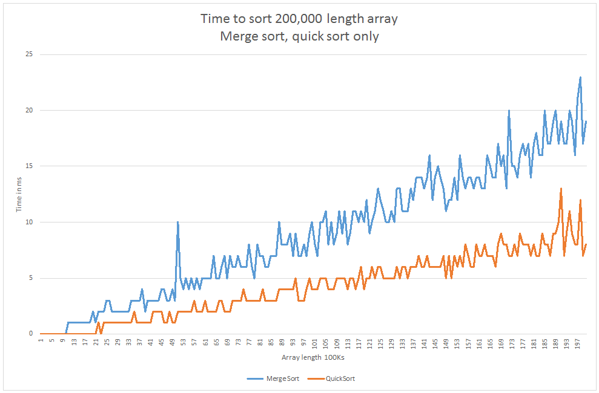
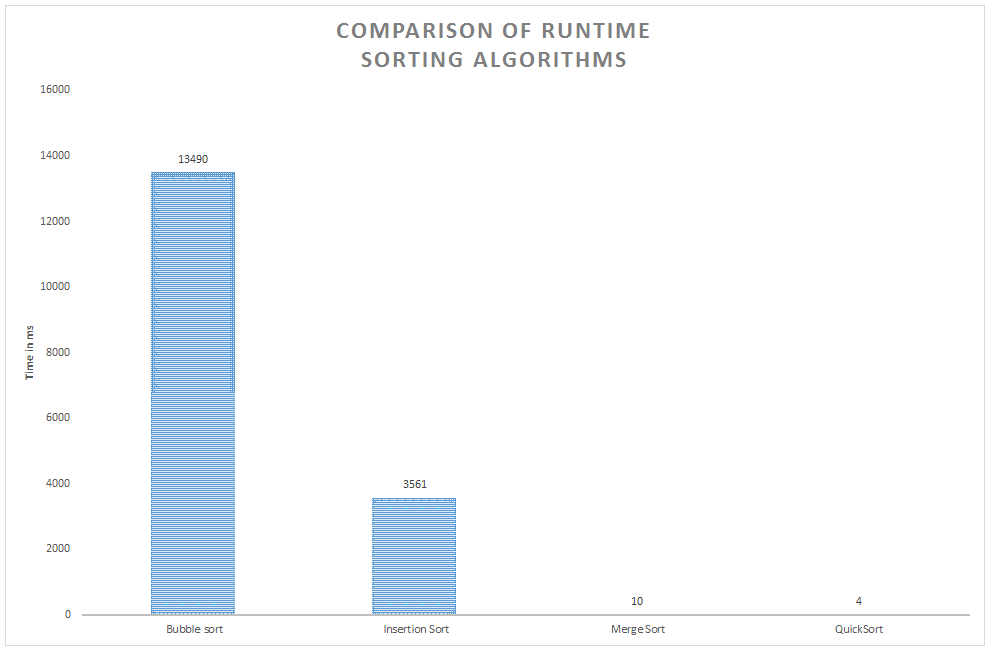

# Data Structure and Algorithms coursework
Joe Halloran

## Part 1: Analysis of sorting algorithms

To compare the efficacy of different sorting algorithms I have randomly generated arrays of differing lenghths (starting at 10,000 all the way to 200,000, incrementing by 1000 each time).  Each array contains integers, randomly generated between 1 and 50.

Each randomly generated array was copied 4 times (using the Java ) `Array.clone()` method and then passed to 4 different sorting algorithms.
* Bubble sort
* Insertion sort
* Merge sort
* Quick sort

The speed by which these algorithms sorted the data was recorded using Java's `System.nanoTime()`. Results were compared to induce the efficiency of each algorithm.

*Fig 1* Shows how each algorithm performed as the array length increases. It clearly shows bubble sort performs worse that insertions sort, which in turn performs worse than merge sort and quick sort.

Incidentally, it appears as if quick sort is not on the graph. This is because it is so close in performance to merge sort, that graphic cannot render both lines separately.

For this reason, a focused comparison of merge sort and quick sort is supplied in *fig 2*. It shows that quick sort narrowly outperforms merge sort. The fluctuations in the graph relate to variations in the distribution (tending towards worse or best case scenarios) of the randomly generated arrays.

*Fig 3* focuses specifically on a randomly generated array of length 100,000, again comprised of integer values 1-50. It further supports the findings outlined above.

### *Fig 1: Run time of various sorting algorithms*



### *Fig 2: Run time of merge sort and quick sort algorithms only*



### *Fig 3: Comparison of runtime for various sorting algorithms*



### Time complexity discussion

The time taken to complete bubble sort and insertion sort grows exponentially as the array lengths increase. Both have time complexity of 0(n^2) (in the 'average' case), meaning the time to execute increases at an accelerated rate, where the array length increase at a fixed rate. This makes them entirely undeseriable, for sorting data on any serious scale.

As observed above, merge sort and quick sort, are much faster. That have a time 0(n log(n)) (in the 'average' case). This means the increase in execution time deccelerates as the array length increases at a fixed rate. This is not to say it get *quicker* as the array length increases (that would be truelly miraculous). It means that the rate of growth slows down, much like it does in human beings: babies grow rapidly in the first month of their life, but then as humans get older growth slows down. This is a highly desirable property for sorting algorithms, as it means the additional time cost descreases every time you add one to the array length. This means both arrays are well suited to sorting large data sets.

## Part 2: Segregate even and odd numbers

### Pseudo code 

```
// Pseudo code
input array[]
low ← 0
high ← array.length
while low < high do
    while low < array.length and array[low] % 2 = 0 do       // Find next odd numbers at bottom of list
        low ← low + 1           // Increment
    end while
    while high >= 0 and array[high] % 2 = 1 do              // Find next even number at top of list
        high ← high - 1         // Decrement
    end while
    if low < high:                              // Only swap if odd number is lower in list than even numbers
        // Swap values
        temo ← array[low]
        array[low] ← array[high]
        array[high] ← temp
end while
```

### Time complexity discussion


## Part 3: Recursion

### Recursive method for A(n) - pseudo code
This algorithm works on the assumption that the code can 
```
// Pseudo code
A(n) {
    if n = 1 or n = 2 then // Base case 1 and 2
        return 1
    else if n = 3 then      // Base case 3
        return 2
    else
        return A(n-1) + A(n-3)  // Recursion call
    end if
}
```

### A(5)

                        A(5) = A(4) + A(2)
                              /          \
            A(4) = A(3) + A(1)            A(2) = 1
                   /         \                 /
          A(3) = 2          A(1) = 1          /
                   \          /              /                        
               A(4)= 2 + 1 = 3              /
                               \           /
                         A(5) = 3    +    1 = 4

### All possible arrangements for A(6)

A(6) = 6

* MMMMMM
* CMMM
* MCMM
* MMCM
* MMMC
* CC

# Refs
http://bigocheatsheet.com/
http://discrete.gr/complexity/
